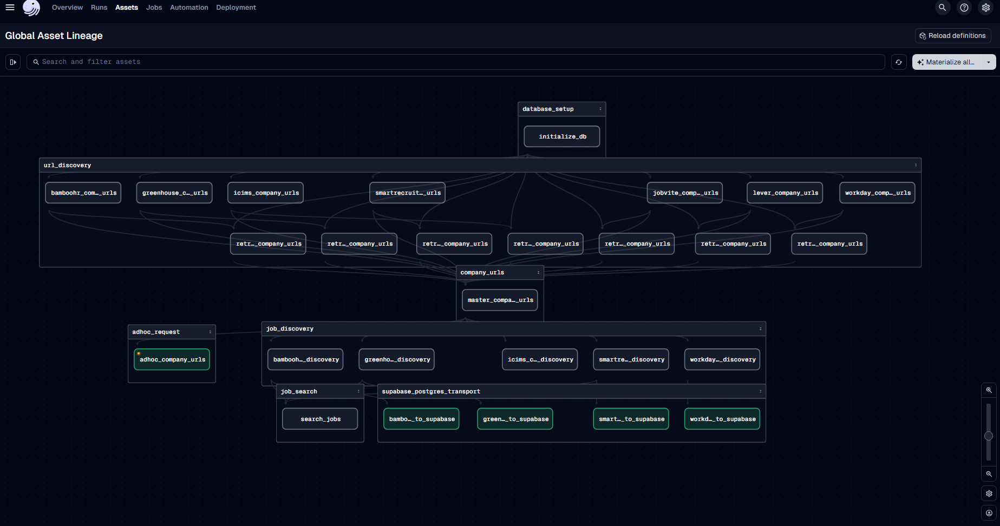

# BetterJobs

BetterJobs is a comprehensive job search platform that retrieves job postings directly from company career portals across various Applicant Tracking Systems (ATS) such as Workday, Greenhouse, and more. This approach allows users to discover job opportunities as soon as they are posted, rather than waiting for them to appear on aggregator sites like LinkedIn or Indeed.

## ⚠️ Disclaimer

**This is a personal work in progress project.**

- This project is not officially supported
- Use at your own risk
- No warranty or support is provided
- The codebase may change significantly without notice
- Use responsibly and for personal research only

## Project Architecture

The project consists of three main components:

1. **Pipeline**: A Dagster data pipeline for retrieving, processing, and storing job data
2. **Frontend**: A React application for searching and browsing job listings (in the `site` directory)

For frontend-specific setup and information, see the [Frontend README](site/README.md).

### Data Flow Architecture

```
Job Sources (Workday, Greenhouse, etc.)
         ↓
   URL Discovery Jobs
         ↓
    Job Discovery Jobs
         ↓
 BigQuery/Supabase Storage
         ↓
    Frontend (React)
         ↓
      End User
```

### Pipeline Components
- **URL Discovery**: Finds career site URLs for companies using various strategies
- **Job discovery**: Extracts job listings from company sites, varies by ATS platform
- **Data Processing**: Normalizes job data and performs content enrichment
- **Data Storage**: Stores job and company data in BigQuery and Supabase

### Dagster Pipeline Visualization

The following diagram shows the structure of our Dagster pipeline assets, including URL discovery, job discovery, and data transport components:



### Frontend Components
- **Search**: Advanced job search with filters
- **Company Browser**: View companies and their job listings
- **Job Detail View**: View complete job listings with formatted descriptions

## Getting Started

### Prerequisites

- Node.js (v18+)
- Python (v3.10+)
- Docker (optional, for containerized deployment)
- Dagster
- Access to the following external services:
  - Google Cloud Platform (BigQuery)
  - Supabase
  - Google AI Gemini API
  - OpenAI API (optional)

### External Service Setup

#### 1. Google Cloud Platform
- Create a GCP project
- Enable BigQuery API
- Create a service account with BigQuery permissions
- Generate and download a service account key (JSON)
- Encode the JSON key as base64 for environment variables

```bash
# Example: Convert service account JSON to base64
cat service-account.json | base64 -w 0 > credentials.b64
```

#### 2. Supabase
- Create a Supabase project
- Set up the jobs table in supabase via the prisma migration in the frontend project under site/
- Note: Supabase is only needed if using the frontend.
- Get your Supabase URL and API keys

#### 3. Gemini API
- Set up Google AI Studio account
- Generate an API key for Gemini

### Environment Configuration

Create a `.env` file in the project root with the following variables:

```
# GCP/BigQuery
GCP_PROJECT_ID=your_gcp_project_id
GCP_DATASET_ID=your_bigquery_dataset
GCP_LOCATION=us
GCP_CREDENTIALS=base64_encoded_service_account_key

# Supabase
SUPABASE_HOST=your_supabase_host.supabase.co
SUPABASE_USER=postgres
SUPABASE_PASSWORD=your_db_password
SUPABASE_DB=postgres

# AI APIs
GEMINI_API_KEY=your_gemini_api_key
OPENAI_API_KEY=your_openai_api_key

# Frontend (site/.env)
SUPABASE_URL=your_supabase_url
SUPABASE_ANON_KEY=your_supabase_anon_key
```

### Installation

1. Clone the repository
```bash
git clone [repository URL]
cd betterjobs
```

2. Set up the Dagster pipeline
```bash
cd pipeline/dagster_betterjobs
pip install -e .
```

The `setup.py` file includes all necessary dependencies including:
- Dagster and related packages
- DuckDB and Postgres connectors
- Google Cloud dependencies
- Web discovery tools (BeautifulSoup, lxml)
- Gemini AI integration

3. Set up the frontend
```bash
cd ../../site
npm install
```

### Running the Application

1. Start the Dagster pipeline
```bash
cd pipeline/dagster_betterjobs
dagster dev
```

The Dagster UI will be available at `http://localhost:3000` where you can run jobs, materialize assets, and monitor the pipeline.

2. Start the frontend
```bash
cd ../../site
npm run dev
```

The frontend will be available at `http://localhost:5173`.

## Pipeline Jobs

The following Dagster jobs are available to run:

- **URL Discovery Jobs**:
  - `workday_url_discovery_job`: Discover Workday career URLs
  - `greenhouse_url_discovery_job`: Discover Greenhouse career URLs
  - `bamboohr_url_discovery_job`: Discover BambooHR career URLs
  - `smartrecruiters_url_discovery_job`: Discover SmartRecruiters career URLs
  - And others (lever, jobvite, icims)

- **Job Position Discovery Jobs**:
  - `bamboohr_jobs_discovery_job`: Find BambooHR jobs
  - `greenhouse_jobs_discovery_job`: Find Greenhouse jobs
  - `workday_jobs_discovery_job`: Find Workday jobs
  - `smartrecruiters_jobs_discovery_job`: Find SmartRecruiters jobs

- **End-to-End Jobs**:
  - `full_jobs_discovery_and_search_job`: Run all URL discovery, job discovery, and data enrichment

See the Dagster UI for the complete list of available jobs and their descriptions.

## Usage Workflow

### Adding Company Data Sources

1. For each supported ATS platform, create or update a CSV file named `[ats-name]_companies.csv` under the `pipeline/dagster_betterjobs/dagster_betterjobs/data_load/datasource` directory with the following headers:

```
company_name,company_industry,employee_count_range,city,platform
```

Example for Workday:
```
company_name,company_industry,employee_count_range,city,platform
Acme Corp,Technology,1001-5000,San Francisco,workday
Widget Inc,Manufacturing,5001-10000,Chicago,workday
```

Supported platforms include:
- workday
- greenhouse
- bamboohr
- smartrecruiters
- lever (job discovery not implemented yet)
- jobvite (job discovery not implemented yet)
- icims (job discovery not properly implemented yet)

2. After updating CSV files, you need to run the relevant URL discovery jobs to detect the career sites for these companies.

### Asset Materialization Workflows

There are two main approaches to running the pipeline:

#### Option 1: Full Asset Materialization

To materialize all assets in the pipeline, including URL discovery and job discovery:

```bash
cd pipeline/dagster_betterjobs
python -m dagster asset materialize
```

This approach is useful for initial setup or when adding many new companies.

#### Option 2: Adhoc Company Processing

For quickly adding or updating specific companies:

1. Materialize the master_company_urls asset:
```bash
cd pipeline/dagster_betterjobs
python -m dagster asset materialize -a master_company_urls
```

2. Add company entries to `pipeline/dagster_betterjobs/input/adhoc_companies.csv` with the following format:
```
company_name,company_industry,platform,ats_url,career_url,url_verified
Acme Corp,Technology,workday,https://acme.wd1.myworkdayjobs.com/acme_careers/,https://www.acme.com/careers,True
```

3. The adhoc_company_urls_sensor will automatically detect changes to this file and trigger the relevant job discovery pipelines.

### Scheduling Jobs

For automated use, you should configure appropriate schedules:

1. The URL discovery assets (`*_company_urls`) only need to run when you update the datasource CSV files with new companies.

2. The job discovery assets need to run frequently to find new job postings.

To modify the built-in schedules or create new ones:

1. Edit `pipeline/dagster_betterjobs/dagster_betterjobs/schedules.py` to adjust:
   - Run frequency (cron schedule)
   - Assets to materialize
   - Execution parameters

Example configuration:
```python
@schedule(
    cron_schedule="0 */4 * * *",  # Every 4 hours
    job=data_engineering_job,
    execution_timezone="America/New_York",
)
def jobs_every_four_hours_schedule():
    return RunRequest(
        run_key=None,
        run_config={},
        tags={"schedule": "jobs_every_four_hours"},
    )
```

2. Add your new schedule to the `definitions.py` file in the schedules list.

3. When running Dagster, your schedule will appear in the UI where you can turn it on.

### Best Practices for Resource Usage

- URL discovery jobs should be run less frequently (monthly)
- Job discovery jobs should be run more frequently (daily or multiple times daily)
- To conserve resources, focus on platforms with high job turnover
- Some ATS platforms have rate limits - avoid running jobs too frequently

## Features

- **Early Job Discovery**: Find jobs as soon as they're posted
- **Direct Links**: Apply directly through company career sites
- **Comprehensive Search**: Filter by title, company, location, and more
- **Statistics**: View trends in job postings across platforms
- **Company Tracking**: Monitor job listings from specific companies

## Contributing

This is a personal project and not actively seeking contributions. However, feel free to fork the repository if you find it useful.

## License

This project is licensed under the MIT License - see the LICENSE file for details.

---

Built as a personal project for exploring job market data and modern web technologies.
